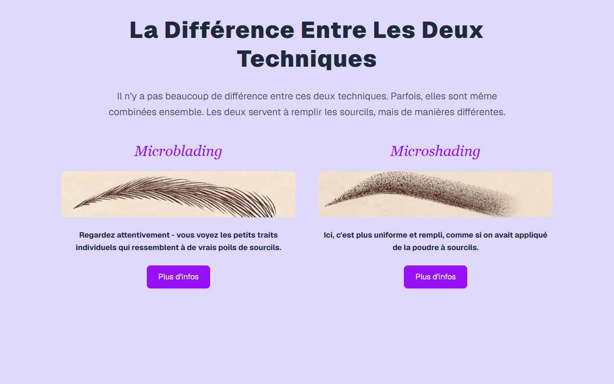

# Aperçu Technique — Microblading + Microshading Slide 2

**Course:** MICROBLADING + MICROSHADING  
**Slide:** 2  
**Live URL:** https://mbds.edtechiecorp.com  
**Stack:** Next.js · Tailwind CSS · TypeScript · GitHub Pages  

## What this slide does

A comparative overview slide explaining the differences between microblading and microshading, their respective use cases, and how the two techniques are combined in a hybrid treatment. Learners at slide 2 are introduced to the core concept of the course — understanding why combining both techniques produces fuller, more dimensional brow results than either method alone. Includes visual side-by-side comparisons of brow results.

## Screenshot

## Usage

This slide is embedded as an iframe inside Coassemble at the live URL above. DNS is managed via Cloudflare (`edtechiecorp.com`). To update the slide, push to the `main` branch — GitHub Actions will rebuild and redeploy automatically.
